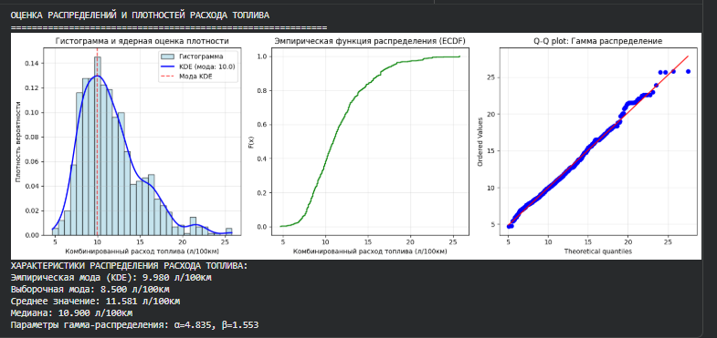
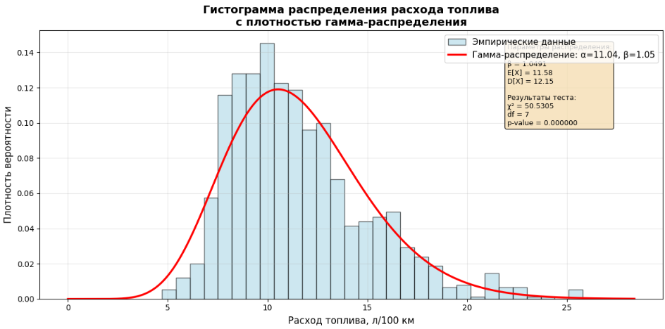

# Fuel Consumption Statistical Analysis

Проект по исследованию факторов, связанных с расходом топлива автомобилей, объединяет разведочный анализ данных, статистические гипотезы, регрессионное моделирование и идентификацию распределений на Python.



## Задача

Цель проекта — исследовать комбинированный расход топлива `FUELCONSUMPTION_COMB` и ответить на четыре вопроса:

1. Как распределён расход топлива и насколько выборка однородна?
2. Различается ли расход у бензиновых и дизельных автомобилей?
3. Различается ли расход у компактных автомобилей и внедорожников?
4. Какое теоретическое распределение лучше описывает наблюдаемые значения?

## Данные

Использован открытый набор [FuelConsumption на Kaggle](https://www.kaggle.com/datasets/shahulhameedkotta/fuelconsumption), содержащий технические и экологические характеристики 1 067 автомобилей 2014 года.

Целевая переменная — комбинированный расход топлива в литрах на 100 км. Для анализа также используются:

- `ENGINESIZE` — объём двигателя;
- `CYLINDERS` — количество цилиндров;
- `FUELTYPE` — тип топлива;
- `VEHICLECLASS` — класс автомобиля.

## Что сделано

- проверены пропуски, типы данных и уникальные значения;
- рассчитаны описательные статистики и доверительные интервалы;
- построены вариационный ряд, гистограмма, KDE и ECDF;
- выполнена проверка нормальности критерием Шапиро–Уилка;
- сравнены группы критериями Уэлча и Манна–Уитни;
- построена OLS-регрессия по объёму двигателя и числу цилиндров;
- проверено согласие с распределениями критериями Колмогорова–Смирнова и Пирсона;
- выполнено сравнение гамма-распределения и распределения Бирнбаума–Саундерса методом анаморфоз.

## Ключевые показатели

| Метрика | Значение |
|---|---:|
| Наблюдений | 1 067 |
| Среднее | 11,581 л/100 км |
| Медиана | 10,90 л/100 км |
| Мода | 8,50 л/100 км |
| Стандартное отклонение | 3,486 л/100 км |
| Асимметрия | 1,03 |
| Эксцесс | 1,23 |
| 95% ДИ среднего | [11,372; 11,790] |
| 95% ДИ дисперсии | [11,180; 13,251] |

Среднее выше медианы, а медиана выше моды. Положительная асимметрия указывает на правый хвост: большинство автомобилей имеет умеренный расход, а крупные и мощные модели формируют высокие значения.

## Проверка гипотез

### 1. Бензиновые и дизельные автомобили

**H₀:** средний расход автомобилей с `FUELTYPE = Z` и `FUELTYPE = D` одинаков.  
**H₁:** средние значения различаются.

Использован t-критерий Уэлча для независимых выборок.

| Показатель | Значение |
|---|---:|
| t-статистика | 9,8077 |
| p-value | < 0,001 |
| Cohen's d | 1,5063 |
| Среднее, бензин | 11,65 л/100 км |
| Среднее, дизель | 8,21 л/100 км |

**Вывод:** H₀ отвергается. Между группами есть статистически значимое различие с большим размером эффекта.

### 2. Компактные автомобили и внедорожники

**H₀:** распределения расхода в классах `COMPACT` и `SUV` одинаковы.  
**H₁:** распределения различаются.

Использован непараметрический критерий Манна–Уитни.

| Показатель | Значение |
|---|---:|
| p-value | < 0,01 |
| Медиана, COMPACT | 8,85 л/100 км |
| Медиана, SUV | 11,20 л/100 км |

**Вывод:** H₀ отвергается. Внедорожники имеют более высокий типичный расход топлива.

### 3. Соответствие гамма-распределению

**H₀:** выборка получена из гамма-распределения.  
**H₁:** эмпирическое распределение отличается от гамма-модели.

По критерию Колмогорова–Смирнова получены `KS = 0,0553`, `p = 0,0028` при критическом значении `0,0416`.

**Вывод:** точное соответствие гамма-распределению формально отвергается на уровне значимости 0,05.

## Проверка нормальности

Критерий Шапиро–Уилка дал `W = 0,937754` и `p < 0,001`. Нулевая гипотеза о нормальности отвергается. Распределение целевой переменной правостороннее, поэтому в проекте используются как параметрические, так и непараметрические методы.

## OLS-регрессия

Оценена зависимость расхода топлива от объёма двигателя и количества цилиндров:

```text
FUELCONSUMPTION_COMB = 4,5142 + 1,812 × ENGINESIZE + 0,173 × CYLINDERS
```

`R² = 0,6726`: модель объясняет около 67,3% вариации расхода. При прочих равных увеличение объёма двигателя на 1 литр связано с ростом прогнозируемого расхода примерно на 1,81 л/100 км, а добавление цилиндра — примерно на 0,17 л/100 км.

## Идентификация распределения

### Критерий Пирсона

| Распределение | Параметры | χ² | df | Результат |
|---|---|---:|---:|---|
| Гамма | α = 11,0390; β = 1,0491 | 50,3503 | 7 | H₀ отвергается |
| Бирнбаума–Саундерса | γ = 0,5783; β = 9,9219 | 385,5363 | 8 | H₀ отвергается |

Обе точные модели отвергаются, но χ² гамма-распределения значительно меньше. Среди двух вариантов оно заметно лучше приближает эмпирические данные.

### Метод анаморфоз

Для распределений построены Q-Q графики и регрессионные прямые между теоретическими и эмпирическими квантилями. Для хорошего соответствия ожидаются `R² → 1`, наклон `a → 1` и свободный член `b → 0`.

| Распределение | R² | Наклон | Сдвиг | Интерпретация |
|---|---:|---:|---:|---|
| Гамма | 0,985489 | 0,993073 | 0,080636 | Параметры близки к идеальным |
| Бирнбаума–Саундерса | 0,982460 | 1,939248 | −10,8793 | Сильное расхождение масштаба и правого хвоста |



Высокого `R²` недостаточно для выбора модели. У гамма-распределения наклон близок к единице, а сдвиг близок к нулю. У распределения Бирнбаума–Саундерса оба параметра сильно отклоняются от идеальных значений.

## Почему гамма-модель выбрана после формального отклонения H₀

На большой выборке критерии согласия чувствительны даже к небольшим отклонениям, особенно в хвостах. Формальное отклонение H₀ означает, что гамма-распределение не является точным законом для всей совокупности, но его можно использовать как приближённую рабочую модель.

В пользу гамма-распределения говорят:

- область определения только на положительных значениях;
- естественное описание правосторонней асимметрии;
- значительно меньшее χ² по сравнению с альтернативой;
- почти идеальные параметры анаморфозы;
- хорошее соответствие в центральной и левой частях распределения.

## Итоги

- Расход топлива имеет ненормальное правостороннее распределение.
- Тип топлива и класс автомобиля связаны со значимыми различиями в расходе.
- Объём двигателя и число цилиндров объясняют около 67% вариации целевой переменной.
- Гамма-распределение не является точным законом, но лучше альтернативы описывает данные как рабочая модель.
- Метод анаморфоз подтвердил преимущество гамма-модели над распределением Бирнбаума–Саундерса.

## Запуск

```bash
python -m venv .venv
source .venv/bin/activate
pip install -r requirements.txt
python analysis.py Fuel_Consumption.csv
```

На Windows используйте `.venv\\Scripts\\activate`. Результаты сохраняются в каталоге `results`.

## Структура репозитория

```text
.
├── analysis.py                 # Сценарий статистического анализа
├── DATA.md                     # Инструкция по получению датасета
├── fuel-consumption-distribution.png  # Гистограмма, ECDF и Q-Q график
├── gamma-distribution-fit.png         # Аппроксимация гамма-распределением
├── requirements.txt            # Зависимости Python
└── README.md
```

## Стек

`Python` · `pandas` · `NumPy` · `SciPy` · `scikit-learn` · `Matplotlib` · `Seaborn`

## Автор

Даниил Бычков
